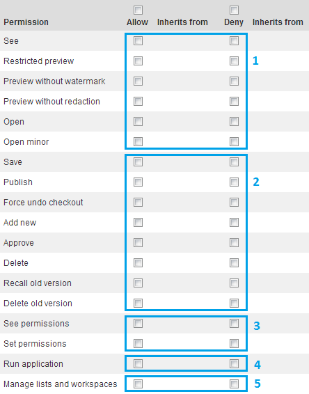
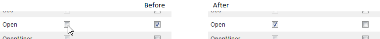
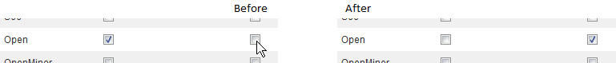
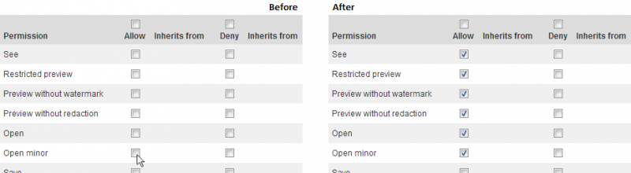
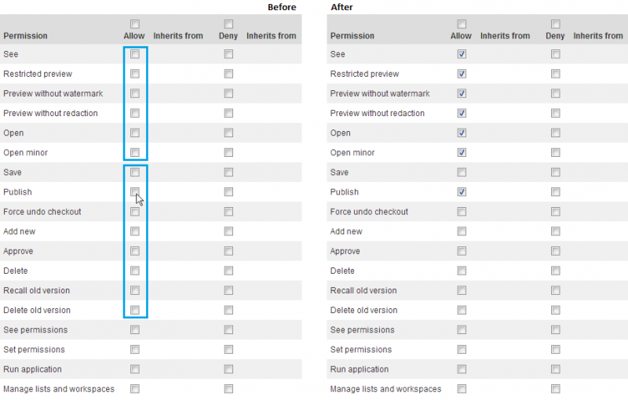
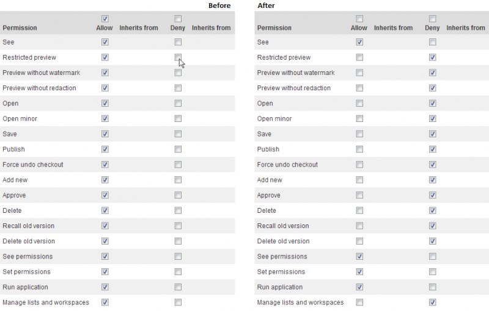
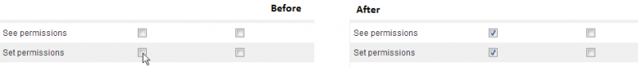
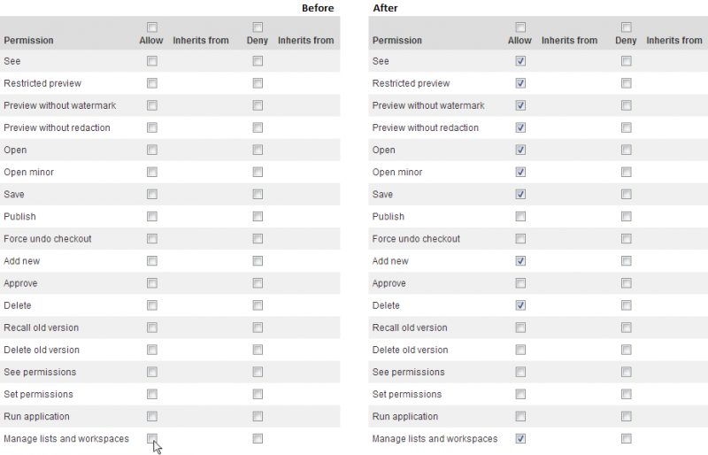

# Permission constraints

You can set different permissions on a single Content for users/groups/organizational units using the sensenet [Permission System](permission-system). There are a number of different permission types that can be used to control different types of access - access like see, open, save, etc. These permission types are related to each other and setting a specific permission type may result in automatic setting of another.

These constraints are implemented both on the UI and on the backend, there is no way to circumvent them.

### Permission groups
The different permission types fall into one of the four permission groups:

1. Read permissions: **See, Open, OpenMinor**,
2. Write permissions: **Save, Publish, ForceCheckin, AddNew, Approve, Delete, RecallOldVersion**,
3. Permission control: **SeePermissions, SetPermissions**,
4. Application: **RunApplication**.
5. Workspace administration: **Manage lists and workspaces**.

### Permission constraints
##### 1. Checking any 'Deny' checkbox clears 'Allow' in same row and vice versa.

 

##### 2. There are five levels of read permissions. Allowing a higher level allows lower levels.

> Except: *Preview without watermark* and *Preview without redaction* are independent from each other so these permissions are on the same level.

- Allow *Open* allows *See*:
- Allow *Restricted preview* allows *See*:
- Allow *Preview without watermark* or *Preview without redaction* allows *Restricted preview* and *See*:
- Allow *Open* allows all Previews and *See*
- Allow *OpenMinor* allow *Open*, 3 Previews and *See*.
- Allow *OpenMinor* allows *Open* and *See*:

##### 3. Allowing any write permission allows every read permission.
E.g. allowing *Publish* allows *See*, *Open*, *OpenMinor*:

##### 4. Clearing a lower read level clears higher read levels and every write permission. In the same way denying a lower read level denies higher read levels and every write permission.

> Exception: *Preview without watermark* and *Preview without redaction* do not clear or deny each other,
e.g. denying *Restricted preview* denies *Preview without watermark*, *Preview without redaction*, *OpenMinor*, every write permissions: *Save, Publish, ForceCheckin, AddNew, Approve, Delete, RecallOldVersion, DeleteOldVersion* and *Manage lists and workspaces*.

##### 5. Permission controlling permissions
Allowing *SetPermissions* allows *SeePermissions*. Clearing/denying *SeePermissions* clears/denies *SetPermissions*.

##### 6. Manage List and workspaces permission
Allowing *Manage List and workspaces* allows all permissions in the open group, *Save*, *Add new* and *Delete* permissions. Clearing or denying  any of the mentioned permission clears or denies the *Manage List and workspaces*.

Allowing *Manage List and workspaces:*

