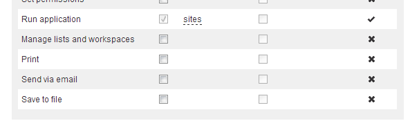

# Custom permissions

sensenet comes with a built-in [permission system](permission-system) with the most common permission types. The predefined permission type set is adequate in most cases, but there might be some situations when it is desired to define custom permissions on content - for example if you want to control whether a specific user is allowed to print a certain document or not. This setting would be much more than a simple global role, since the setting could vary for different content and for different users at the same time.

Besides the built-in permission types (*See*, *Open*, etc.) sensenet defines 14 custom permission types (*Custom01*, *Custom02*, etc.) that can be used for custom permission settings. A common example would be to allow a user to print a document (or deny it): for this builders/developers could assign the permission type Custom1 and use it consistently in the system to check permissions and allow or disallow printing.

### Showing custom permissions in permission editor [legacy]
By default the permission editor will only show the 18 built-in permission types. To show custom permissions in the list of permission types do the following:

Edit the following control:

```
/Root/System/SystemPlugins/Controls/PermissionEditor.ascx
```

At the top of the layout you will find a script running on server side overriding the *OnInit* function:

```csharp
protected override void OnInit(EventArgs e)
{
    ((SenseNet.Portal.UI.Controls.PermissionEditor)this).VisiblePermissionCount = 18;
    base.OnInit(e);
}
```

Increase the value of the *VisiblePermissionCount* property from 18 to the desired amount (eg.: 19 if you want to display *Custom01*, or 32 if you want to display all permission types).

After saving the file you will see the custom permissions appear in set permission dialogs.


### Setting display name of custom permissions
Permission type names are internationalized which means that names come from string resources. You can find string resources of permission type names in the following resource file at keys starting with "Permission_".

```
/Root/Localization/PortalResources.xml
``` 

After editing the custom names you should see something like the following in the permission editor.



### Showing custom permissions in required permissions
[Applications](application) can ask for required permissions on content whenever a user tries to open the content with the specific application. For example if you have an application that deletes the content you can set the 'Delete' permission at the required permissions list of your app (it is a field on the application content) and thus the user will not be able to click on your action link if the user is not allowed to delete the content.

Custom permissions can also be used with this feature. To show custom permissions in the required permissions field do the following:

Edit the CTD of the *Application* type:

```
/Root/System/Schema/ContentTypes/GenericContent/Application
```

At the definition of the *RequiredPermissions* field set the *VisiblePermissionCount* to the number of permissions you want to display.

```xml
<Field name="RequiredPermissions" type="Choice">
  ...
  <Configuration handler="SenseNet.ContentRepository.Fields.PermissionChoiceFieldSetting">
    ...
    <VisiblePermissionCount>18</VisiblePermissionCount>
  </Configuration>
</Field>
```

### Checking if a user has a custom permission on a content
You can use the usual techniques to check for permissions. Simply use Custom01 - Custom17 permission types:

```csharp
var node = Node.LoadNode(path);
if (node.Security.HasPermission(PermissionType.Custom01)) 
{
   // ...
}
```

If you want to use named properties, simply create an alias in your code base:

```csharp
public PermissionType PrintPermission
{
   get
   {
      return PermissionType.Custom01;
   }
}
```

After that you can use it the usual way:

```csharp
if (node.Security.HasPermission(PrintPermission))
{
   // ...
}
```
