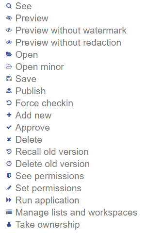
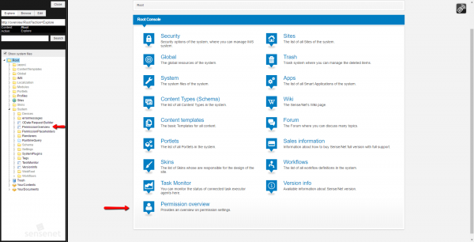
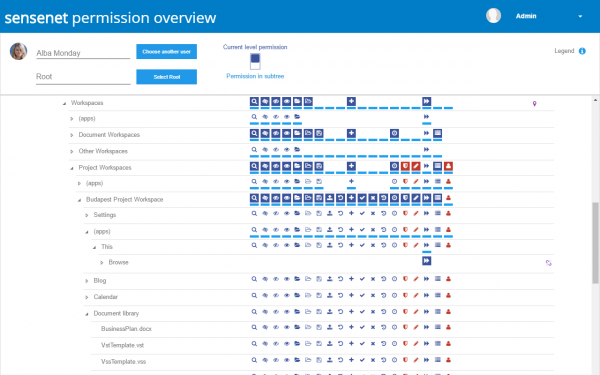
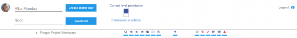
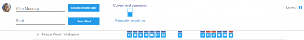
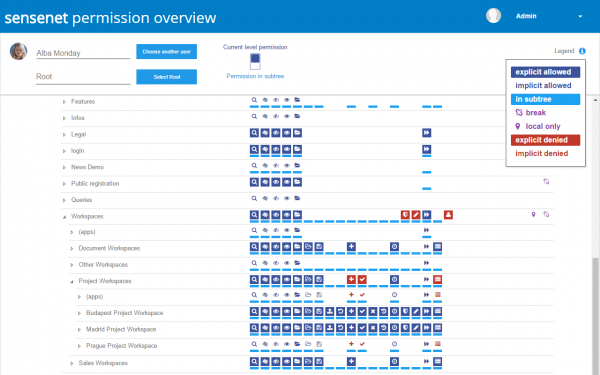
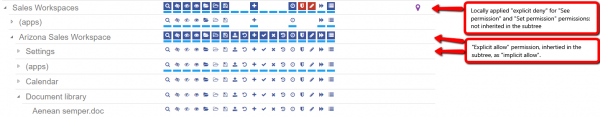
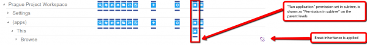
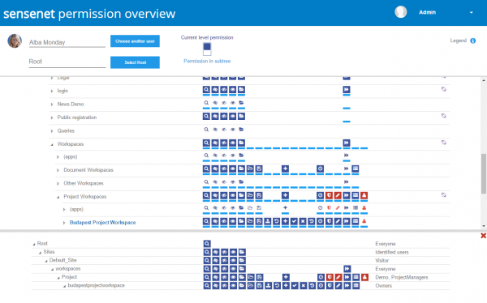

# Permission Overview

If you ever struggled to understand the permission structure related to a certain user, not just for a single content but in the whole system, you know how difficult it can be. We have had a permission setting page for each content for a long time and now we developed a tool that gives administrators the full picture.

Our permission visualization tool provides an overview on any user's permission settings over all contents throughout the Content Repository. With the use of a tree view, the tool will display the permission structure of all built-in permission types in the whole repository or in a chosen subtree. Each permission type is represented by an icon, as shown in the following picture:

To learn more about the sensenet Permission system and its operation, please visit the following article:
- [Permission System](permission-system)

The tool is available on the *PermissionOverview* page in the */Root/System* folder and it is also accessible from the Root Console:

Permission Overview is a useful tool to figure out which parts of the system are accessible by a certain user. The inheritance structure is also displayed in a transparent way as well. It also helps in adjusting permissions by the detailed overview provided on the whole permission structure, so it is easily predictable what will happen if you change any of the permissions.

## Main areas
The overview layout is divided into the following three main sections.

### Top bar section
- **User switch:** choose the user, whose permission set will be examined. By default the logged in user is selected.
- **Root selector:** select the root of the tree that will be displayed in the overview tool. By default the "Root" folder is selected
- **View switch:** 
   - by default it shows the actual content's own permission set, all inherited and explicitly set allow or deny permissions are presented in this view: 

   - The second mode is a handy view to help find permission entries in the subtree, and avoid unnecessary searching in subtree-branches that are irrelevant for the selected user.

##### Legend
On the right of the topmost section there is a panel that helps you understand the applied notations on the overview tree.
1. *explicitly allow:* indicates allowed permissions set explicitly on the selected content
2. *implicitly allow:* indicates allowed permissions inherited from a parent node
3. *in subtree:* all permission settings are projected upward that are applied in the subtree of the selected node.
4. *break:* the icon is displayed when "Break inheritance" is set on the content
5. *local only:* indicates if there is at least one permission in that row that is applied only locally, and will not be inherited to subtree.
6. *explicitly denied:* indicates all deny permissions applied on the content itself
7. *implicitly denied:* displays all inherited deny permissions on the content

### Content tree
Under the top bar section, the tree structure of the Content Repository is displayed. Beside every content the basic permission types of sensenet are listed. By each permission type its icon is displayed if the permission is applied on the content, or its place is left empty in case the permission is not set on that level.

**Current level permission structure:** in this default view (using dark blue icons) inherited and explicitly set permissions can be identified easily:

**Permission structure in subtree:** if the view-switch is set to show permissions in the subtree, the second set of permission icons (the light blue ones) are made more visible. In this view the permission type indicators show up if - anywhere in the subtree of the selected content - any modification is applied on that permission type:

### Permission matrix
When a content in the tree is selected, the permission matrix of the selected content opens up at the bottom section of the screen, in a separate panel. This table contains the selected content and its parent chain all the way up to the root, and displays the **permission inheritance** structure. Inherited and explicitly applied permissions are both shown in this panel. Another important feature of the permission matrix is that the **group list** of the permission set - related to the selected user - is shown in the last column of each level. This view is outstanding when the group chain of certain permissions need to be investigated in order to make decisions: if a user should be the member of a certain group, or should be removed in order to set up their permission structure properly.

