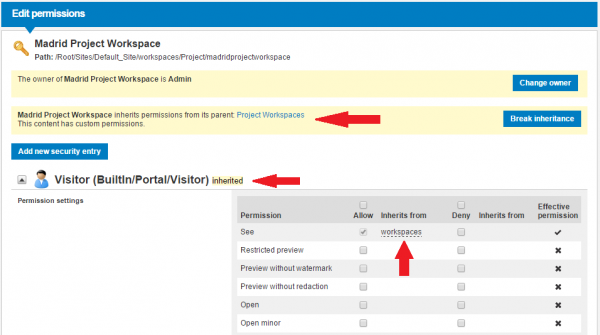
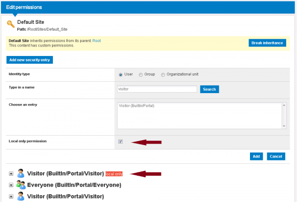

# Permission System

One of the main features in **sensenet** is its complex - yet easy-to-use - permission system. You can set permissions on every [Content](content) in the [Content Repository](content-repository) to restrict user access and to fine-adjust the actions available on specific Content for different users. The sensenet permission system uses a model based on **permission inheritance** with allow and deny rules.

The permission system in sensenet is a mixture of three permission features:

- **declarative permissions**: you can set permissions for a particular user/group/organizational unit on any single content. Every content can have different permission settings. This can be given in usage time and can be changed and fine-adjusted by permission administrators on a running site any time.
- **programmatic permissions**: sensenet allows you to restrict access to a certain custom feature or programmed logic in development time by writing simple code that makes calls to the [Permission API](permission-api).
- **role based permissions**: you can set permissions on a certain functionality to a group of users thus specifying roles in sensenet.

## Identities
Before we go through the different permission models, we have to know the items we are working with. In sensenet there are 3 types of identities you can set permissions for on a content.

#### User
A user represents a single person. It is a content itself that can be created, modified or deleted the same way as other content. 

> To manage users as an administrator, please go to the */Root/IMS* folder in Content Explorer.

Users can be synchronized from [Active Directory](adsync) to let them sign in automatically using their Windows account. All users reside under a **domain** and they must have a unique name and login name inside that domain so that the system can identify them correctly upon login.

#### Group
A group is a content in the Content Repository that *cannot have physical children* but has a *Members* [Reference Field](reference-field) that can contain users or other groups.
>Because a group may have other groups as a member, group membership works in a **transitive** way: if a user is a member of *GroupA* and *GroupA* is a member of *GroupB*, the user is also considered a member of *GroupB*. This means all the permissions set for GroupB will be relevant for the user.

When you set permissions for a group, that setting will be taken into account in case of every single member user when they log in to the system. This is why it is advisable to **set permissions for a group (or organizational unit) instead of individual users**: when a new user comes in or leaves the company, you do not have to bother with permission settings: you just have to add them to a group or remove them from one.

Groups and group memberships can also be synchronized from [Active Directory](adsync).

There are two types of groups in sensenet:
- global groups that can be created under a domain in */Root/IMS*
- [Workspace local groups](workspace-local-groups) that have a smaller scope and can be created to customize the permissions inside a workspace.

There are also a couple of [Special and built-in groups and users](built-in-groups-and-users) in sensenet that worth noting - please review them before you start working with the permission system.

#### Organizational unit
Organizational units work the same way in terms of permission settings as groups: all users under an org unit will receive the permissions set for the org unit. The difference is in the structure: org units do not have members but **child elements** (users, other org units or even subfolders), so they can be used to build a **tree structure** (for example of departments) in the Content Repository. This means users are placed physically under org units, so they cannot be under two org units at the same time (except of course in the same hierarchy, for example sub-department).

Organizational units can also be synchronized from [Active Directory](adsync).

## Declarative permissions
The following apply to declarative permissions in sensenet:
- **Item-based rules.** In sensenet it is possible to define permission rules on individual content that control which users/groups/organizational units can access the given content in what ways. 
- **Can be modified on live sites.** These declarative permission rules can be set up and modified on a live sensenet site, you are not restricted to define permission rules in development time. 
- **Administer permissions via GUI.** You also don't have to write code to change permission settings, sensenet provides a clear-cut GUI to allow administrators change permission settings. This UI can be accessed from Content Explorer via the *Set permissions* action. On that page you can add new permission entries defined for users/groups/organizational units, set allow or deny rules on the specific content. Read the following how-to for details:

[How to set permissions on a content](how-to-set-permissions-on-a-content)

## Programmatic permissions
Besides using a simple GUI to define declarative permissions it is also possible to work with permissions programmatically. This can be useful when you want to restrict access to a certain function for a defined set of users/groups/organizational units. sensenet provides a simple API to check permissions in the following aspects:

- **Membership check.**: whether the current user is part of a specific group or organizational unit.
- **Check permission on a content**: whether the current user has certain permissions to a specific content.

Programmatic permissions are defined at development time, but of course it is always possible to implement permission checks in a flexible, configurable way. Read more info on using programmatic permissions in the [Permission API](permission-api) article.

## Role based permissions
Within an organization roles are created for various job functions. The permissions to perform certain operations are assigned to specific roles. Members of staff (or other system users) are assigned particular roles, and through those role assignments acquire the permissions to perform particular functions. Since users are not assigned permissions directly, but only acquire them through their role (or roles), management of individual user rights becomes a matter of simply assigning appropriate roles to the user's account; this simplifies common operations, such as adding a user, or changing a user's department. See more info about the role-based security concept here:

- [Role-based access control on WikiPedia](http://en.wikipedia.org/wiki/Role-based_access_control).

In sensenet there are different approaches to assign roles and many role based security problems can be solved with *declarative permissions* (see above) that makes role based permission handling in sensenet flexible and easy-to-use. The following approaches can be used to define role based permissions:

- **Permission setting on Applications.** You can declaratively define permission rules on sensenet [Applications](application). This way you can define which functions can be accessed by whom. A lot of features have been implemented in sensenet using Applications (like copy, move, delete, etc.) thus the basic features can be restricted to any security entity in a declarative manner.
- **Roles by groups.** The most common way to define roles is to create groups and add members to these groups. The created groups will  serve as different roles (for example group of *Editors*). These groups can then be accessed by custom code using the [Permission API](permission-api) to check if the current user is part of the group and thus has the specific role and able to access the related functionality. Global and local groups can be used to represent global and local roles (refer to [Workspace local groups](workspace-local-groups)).
- **Using Permission Placeholders.** A permission placeholder is a dedicated content in the content repository. Features like custom implemented code or services can use it to determine if the current user has access to that particular functionality: if the user has *RunApplication* permission on the permission placeholder content, then access to the functionality will be granted, otherwise no. This approach can be a bit more flexible than using simple groups, since you can also define permission rules for organizational units this way. Built-in permission placeholders are located at */Root/System/PermissionPlaceholders*.

The sensenet role-based permission model comes with the following features:

- **Stock versus custom roles.** There are a number of built-in roles in the default installation (for example the *Administrators*, or *Editors* group, or any pre-defined applications, like */Root/(apps)/GenericContent/Delete* or built-in permission placeholders , like */Root/System/PermissionPlaceholders/Workspace-mvc*). It is also possible to extend the base role system with custom roles: you can create custom global or local groups with custom members, define custom applications with custom permissions, and define custom permission placeholders with custom permission settings. It is also possible to adjust the permissions of the built-in roles: for example you can always modify the members of the Administrators group.
- **Role modeling.** In sensenet you can assign individual users to any role, but it is also possible to define hierarchical role models enabling you to assign a group of users to a certain role. For example:
  - you can add individual users and also groups to members of a local or global group,
  - you can define permissions for users, groups and organizational units on permission placeholder content,
  - you can define permissions for users, groups and organizational units on applications.

### Applications and permissions
When an action request arrives (e.g. edit or delete), the sensenet *application model* handles it: for every content an *application* will be resolved to serve that content. The permission on the application can restrict whether the request can be served or not (e.g. does the user have RunApplication permission? Are there required permissions on the content defined by the application - e.g. Delete permission required by the Delete app).

You can read more about the application framework in sensenet here: 

- [Smart Application Model](smart-application-model)

An important implication of the application model on permissions is the following: since applications (smart pages, etc.) are also content in the Content Repository, users need to have permissions on those, too. So when rendering a content/action, the **users need to have permissions on both the content and the application**. Example: if a user tries to upload a document to a document library, then the user needs See, Open, Save and most importantly *Add new* permissions on the document library and also *Run Application* permission on the Upload action, which can be found at */Root/(apps)/Folder/Upload*. Read more about applications and permissions here: 

- [Application](application)

### Permissions of services and features
There are some special cases when users need to have special permissions to be able to access a feature or a service. Such service for example is the REST Api that handles requests for the content picker or the tree in the Content Explorer. These permissions are controlled by content under the */Root/System/PermissionPlaceholders* folder and in some legacy cases the */Root/System/WebRoot* folder.

## Permission system details

### Permission types

The following types of built-in permissions are defined in the system. These permissions are not customizable:

- **See**: controls whether the user is allowed to see the Content (ie. visible in a list, but [Field](field) data cannot be accessed).
- **Restricted preview**: whether the user is allowed to see a preview of a Content (e.g. a document). All field data can be accessed, except binary fields.
- **Preview without watermark**: whether the user is allowed to see a preview of a Content (e.g. a document) without a watermark. All field data can be accessed, except binary fields.
- **Preview without redaction**: whether the user is allowed to see a preview of a Content (e.g. a document) without redaction. All field data can be accessed, except binary fields.
- **Open**: controls whether the user is allowed to open the Content to see field data of the Content.
- **Open minor**: controls whether the user is allowed to open minor versions of the Content and see corresponding field data.
- **Save**: controls saving of the Content.
- **Publish**: controls publishing of the Content.
- **Force undo checkout**: controls whether the user is allowed to undo pending changes when the Content is checked out to someone else.
- **Add new**: controls creation of new Content under the given Content.
- **Approve**: controls approval of the Content.
- **Delete**: controls deletion of the Content.
- **Recall old version**: controls whether the user is permitted to restore an old version of the Content.
- **Delete old version**: [*currently unused*].
- **See permissions**: controls whether the user is allowed to see permission settings for this Content.
- **Set permissions**: controls whether the user is allowed to manipulate permission settings for this Content.

> Permissions are inherited, so giving access to manipulate permissions of a single Content may result in allowing implicit access to influence permissions of other Content in that subtree as well.

- **Run application**: controls whether the user is permitted to access or manipulate any Content via this Application.
- **Manage lists and workspaces**: controls whether the user is allowed to add, modify or delete Lists or Workspaces.

Customizable permissions:
- **Custom 1** - **Custom 17**: Custom permissions that can be used freely. See [Custom permissions](custom-permissions) for details.

> **Permission names**
> 
> The names of the permissions are internationalized. Resource file is: */Root/Localization/PortalResources.xml*. In the file the permission names are prefixed with 'Permission_'.

### Permission constraints
There may be certain constraints when setting a specific permission on a Content. For example it is not possible (and not rational) to give *Save* permissions for a user, when the user is not allowed to see the given Content. These kinds of permission constraints are handled by the portal both in GUI and in API level. The former means that the permission editor UI provides handy mechanisms to automatically show and set the required permissions for you. See the following article for details:

- [Permission Constraints](permission-constraints)

### Permission inheritance
In sensenet every content is stored in a huge tree with a single root. When you set a permission on a high level item (close to the root), e.g. a site or a workspace, it will be inherited by its children. This way you do not have to set permissions on every subfolder or document, because all content inherit permissions from their parent.

Inherited permissions cannot be changed (without breaking the inheritance, see below) therefore their checkboxes are grayed out. But you can set additional permissions for the same identity (e.g. grant Open permission to someone who already has See permissions inherited).

Of course (as an exception) you may set *local only permissions* that are not propagated to children, see the 'local only permissions' section below for details.

#### Break permission inheritance
You may decide to change some permissions inherited from above - e.g. you inherited an Open permission for a user that you do not want to allow in a subtree. In that case you can *break permission inheritance* on a content. That means all the inherited permission entries will be copied to the current content and from than on you will be able to *change them* (usually remove one or more). The new permission set (even if it contains less entries than the inherited) will be the one that is used in that subtree.

> If possible break permissions in exceptional cases only, because it makes permission administration more complicated. The [Permission Overview](permission-overview) UI may help you work with a complex permission structure.

#### Local only permissions
One of the most powerful features of the permission system in sensenet is the permission inheritance. There are cases however when you **do not want child content to inherit a permission entry**. For example you want to allow certain users to see a content (e.g. a Content List) but you do not want them to be able to see content that were *added to that list*. A typical use case for this is when you allow Visitors to *Open* and *Add* content to a Form but you do not want them to be able to open any items added to the form by others. In this case you would set a local only (in other words *not inherited*) permission entry on the Form for Visitors.
The advantage of this construct is that you **do not have to break inheritance** on the content (in this case the Form), which means any permission entries set on the tree above will still be inherited by child content.
As you can see on the image below you can mark the permission entry as 'local-only' when you add it on the set permission page. Every local-only permission entry is clearly marked on this page. You can even set inherited an local-only entries for the same users or groups side-by-side.

## Allow vs. deny
When you set permissions for an identity, you can either *allow* that user or group to access a certain feature or *deny* it. 

> **Deny is always stronger than allow**.

If you set a deny permission for a certain user, it does not matter if she has allow permission inherited from above or through a group membership - she will not be able to access that feature. You can only make deny permission disappear on lower levels only if you **break permission inheritance** on a subfolder and remove the deny permission there.

> It is advisable to set as few permissions on higher levels (closer to the root) as possible and allow access on subfolders instead of allowing everything on the root and use deny to hide something later. Think of working with *local only permissions* (see above) too to let users see certain content in the tree but not their child items.

## Custom permissions
The built-in permission set can be extended with 17 custom permissions. These permissions are by default hidden from the UI and have no effect on permission checks but a builder or developer can easily bring custom permissions into the set of effective permissions. To learn more about using custom permissions read the following article:
- [Custom permissions](custom-permissions)

## References
- [Role-based access control on WikiPedia](http://en.wikipedia.org/wiki/Role-based_access_control)
