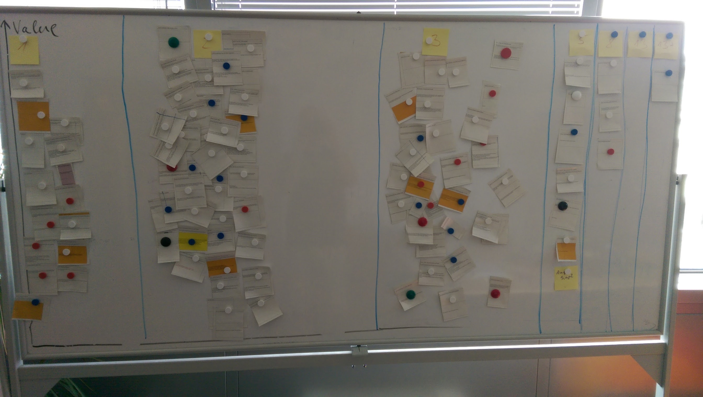

# See how Sense/Net Inc project team work with one of our clients directly

From time to time we have a direct agreement with our customers. By this work connection client&#39;s doubts, confusions and expectations can be examined the best. As an ECM vendor, working customers directly are highly valued but the number of them is limited (because most of the time our partners do it). Customers turn to us when they have a complex [intranet project](https://www.sensenet.com/for-customers/use-cases/intranet), [document management](https://www.sensenet.com/for-customers/use-cases/document-management) issue or want to utilize our [headless EMC](https://www.sensenet.com/for-customers/use-cases/content-repository) for the best.

Although to work with clients are sometimes a challenge, especially because of their desperate background, but cultural, time zone and technology differences give us extra learning experience.

Let us to give you a short overview how we try to focus on and make our customers happy during those projects.

## We are agile – better solution sooner

Here you are some short stories about how we would like to work with you, if we have a common project. During the sales conversation, we lay down the project framework and have a common understanding what we'd like to achieve (overall outcome, features, etc.). Sense/Net Inc uses SCRUM and we encourage our customers to have this common &quot;working language&quot; to make the project successful.

Agile methodology is used in the IT sector because the requirements change quickly. Feedback - received from clients and the market - can be built into the product as fast as possible in that way.

## Minimum Viable Product

First of all, we need to set up the Minimum Viable Product: this is the minimum processes and functions for releasing the product. Generally, the story mapping method is used: in the rows are weeks/sprints/months, and in the columns are the functions. Now we are using google spreadsheet (with direct email address sharing: it's easy to reach from every platform), where we can collaborate, and manage the information. The important functions are put on the top of the rows, while less majors are kept below – this is the way we set the priority (usually during a common meeting with the client).

Some descriptions of this method are found on this link: [https://www.scrumalliance.org/community/articles/2013/august/creating-an-agile-roadmap-using-story-mapping](https://www.scrumalliance.org/community/articles/2013/august/creating-an-agile-roadmap-using-story-mapping)

Our clients usually love this event, because we can use post-its, whiteboard, felt pen, and we can stand up and walk a lot to discuss the details. But it is also the hardest part of the refinement to decide the right scope of the project and keep the customer happy too. 

## The Backlog

After creating the story mapping we usually start to write a backlog – together with the client. We use the story mapping table, where the top functions are copied and start to write the details.

It's the same google spreadsheet, so you have to mark only one URL. (Side note: our JIRA system is under upgrading, in the future we will handle the backlog items there – so we are really waiting for that upgrading :) )

In the spreadsheet there are just a few columns in one row:
- Function ID number (from the contract)
  -- It helps us to compare the extra Change request functions, and the original contract.
  -- We have to track all the new requests that are extra items. We have to check our resources and measure our development commitment because these are limited and new items can not be developed during our common work without contract extension
- Story name, description and acceptance criterias
- Story points and status
- Comment field: just an URL link from another system, where everything can be discussed – in the backlog there are only the validated stories
  -- We use the basecamp system ( [https://3.basecamp.com](https://3.basecamp.com/)) to plan the functions, and add access to every stakeholder of the project

## Refinement, story points, release burnup

Having the right number of stories, we organize an inner meeting with the SCRUM team, and refine the stories: collect questions, estimate story points, split stories.

This meeting – writing stories with the client and refine them by the SCRUM team – goes every week till the end of the project. This is the time for &quot;soft&quot; debates where client and SCRUM team try to convince each others.

If we have story points for every task we create a release burnup chart to estimate the future: it contains the future sprint numbers, the actual story points in the backlog, and calculate a forecast for the future based on the velocity. E.g. there are 300 story points in the backlog, and 20 story point/sprint can be done we will finish the whole backlog in 15 sprints – that's a usual forecast. Also it's important to calculate a best and a worst case forecast too, multiplying the velocity with 1,1 and 0,9. That means that in the worst case just 18 story points can be done in one sprint, so we finish in 17 sprints.

You can see the details here: [http://agilewhys.blogspot.hu/2015/03/how-to-create-release-burn-up-chart.html](http://agilewhys.blogspot.hu/2015/03/how-to-create-release-burn-up-chart.html)

## Big Wall – when we recognize the time is limited

Sometimes we have so many tasks and stories which make the priority more difficult so it's a good way to stop, and reorder and re-estimate the backlog. This is the Big Wall technique. We print all story titles to small papers with the story points (post-it size), and create a big whiteboard chart: axis X is the size of the backlog item, Y is the value. First step is to put the papers on the wall. The biggest tasks are on the right side, the smallest ones are on the left side. After every piece of paper is on the wall we draw straight lines which should cross as many stories as they can: so we have to think over the size of the stories. Finally there will be columns with the refactored story point: 1, 2, 3, 5, 8, 13…

The next step belongs to the customer: they have to organize the papers between bottom and top: the most valuable items are on the top, the less valuable ones are on the bottom.

Last step we cut the whole whiteboard to four parts in the middle:
1. Small task but valuables
2. Big task but valuables
3. Small task but not so valuables
4. Big task and not so valuables

These four categories help you to reorder the backlog!

## NFR – Non Functional Requirements

There is another important stage to create the product the customer expects: the non-functional requirements. We know the business requirements, that for example they need some searching function, but the non-functional requirements tell us the details: speed of search, number of fields to search, what should happen when the connection is slow, ect. there are more than 35 areas what we check in the beginning of the project: performance, IT security, speed, disaster recovery, etc. Each of them can be as important as functional requirements so we never underestimate these needs.

## DOD – Definition of Done

After checking all items in the NFR list we must define what means &quot;Done&quot;, what is a ready function? It's a list of actions we must do after every backlog item. It can contain the type of the browsers type and versions, the role settings, log requirements, verification methods, etc. It helps us to avoid childish mistakes and perform consistently great in every phase of the project.

## Our difficulties

Now we have a big project where Sense/Net Inc is the prime contractor and we have three subcontractors. The SCRUM rules mainly talk about just one team but *fortunately* we have to work together with other teams – in one product. 

So we have to learn it from the Nexus Scrum methodology, which seems to be very interesting for every participant. You can read more about this at <https://www.scrum.org/resources/online-nexus-guide>

## CONCLUSION

The stories about the projects can be continued but that's enough for today.

We've learnt from the past to set up the expectations with the clients at the beginning to have fruitful relationship without too many unmanageable debates. Honest and professional conversations lead us to a successful project and it gives the smile to our clients' face.

Sense/Net Inc. teaches the partners for the same value and commitment towards our common customers.

I hope you like this post and please share your thoughts.

Read more about our [references here](https://www.sensenet.com/references) and [contact us](https://www.sensenet.com/contact) if you want to know us better.
