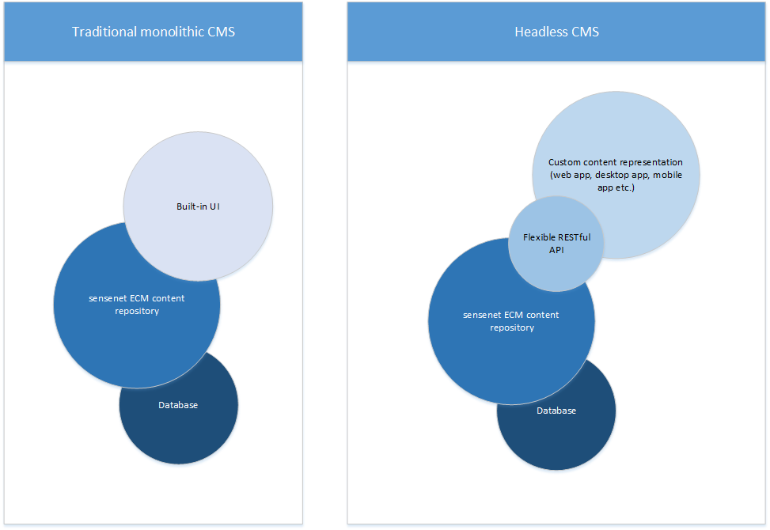

The term 'headless cms' has been rising in popularity for a while now. But why the hype and what is it all about?

---
## What is a headless CMS?
First, it's worth mentioning how traditional "monolithic" cms's work. Wordpress or Drupal are usually included in this category. This means that the modal layer is tightly coupled with the view, and the creators of the platform provide you with a templating engine with which you can implement your frontend. So in this model you'd have:

- a Database at the "bottom", where you store your content
- an App, with a UI that lets you [Create, Read, Update and Delete][25358749] this content
- and a View layer which displays the content (usually by using templates)

  [25358749]: https://en.wikipedia.org/wiki/Create,_read,_update_and_delete "CRUD"


 Older versions of [sensenet ECM][ed1adc41] are also following this philosophy, although the platform is more geared towards enterprise features, such as [content versioning][a19fba28] and [collaboration][206457f6].
 Thus, the 'E' in ECM is for Enterprise.

  [ed1adc41]: https://www.sensenet.com/product "Sensenet ECM Product features"
  [a19fba28]: http://wiki.sensenet.com/Versioning_and_approval "Versioning and approval"
  [206457f6]: http://wiki.sensenet.com/Workspace "Workspaces in sensenet ECM"

This is why you could do something like this in [sensenet 6.x][9f950a61], or using [sn-webpages 7.x][46ac6b1f]:

```xml
<div class="sn-article-list">
    <%foreach (var content in this.Model.Items)
      { %>
    <div class="sn-article-list-item">
	<h2 class="sn-article-title">
		<a href="<%=Actions.BrowseUrl(content)%>">
			<%= content.DisplayName %>
		</a>
	</h2>
        <small class="sn-article-info">
		PublishedBy: <%= content["Author"] %> on 
                <span class='<%= "sn-date-" + content["Id"] %>'>
			<%= content["ModificationDate"]%>
		</span>
	</small>
        <div class="sn-article-lead">
            <%=content["Lead"] %>
        </div>
    </div>
    <%} %>
</div>
```
<p align="center">
*fig 1. ~ The template is tightly coupled with the data it needs to present.*
</p>

  [46ac6b1f]: https://github.com/SenseNet/sn-webpages "Sn-webpages"
  [9f950a61]: http://community.sensenet.com/docs/how-to-install-sn6/ "Install sensenet 6.5"

In a headless CMS (or ECMS for that matter), though, the backend does not care about how the content is displayed. It just returns with the data needed for the frontend through a RESTful API.


<p align="center">
*fig 2. ~ Traditional (coupled or monolithic CMS) model vs. Headless CMS*
</p>

## So is sensenet ECM a headless or a coupled CMS?


As mentioned earlier, using sn-webpages, you can have a full-featured ECMS solution, complete with a built-in UI. We are also working on a **new** UI, using [React][b3358601] and [Aurelia][b56bd31b] while fully utilizing [sensenet ECM's OData layer][71579091], which provides a complete, flexible and extendable [RESTful API][f9c00a93].

  [71579091]: http://community.sensenet.com/docs/built-in-odata-actions-and-functions/ "Built-in OData actions and functions"
  [f9c00a93]: http://community.sensenet.com/docs/odata-rest-api/ "OData REST API"
  [b3358601]: https://github.com/SenseNet/sn-controls-react "React controls for sensenet ECM"
  [b56bd31b]: https://github.com/SenseNet/sn-controls-aurelia "Aurelia controls for sensenet ECM"

In the same time, you can either start writing your own library to latch on the OData endpoints of a sensenet ECM at hand, **or** you can try out our [fabulous and open source sn-client-js, the javascript client library for sensenet][de7f7b73].

  [de7f7b73]: https://github.com/SenseNet/sn-client-js "Sn-client-js"

In the end, what you get is something like this <sup>[1](#footnote1)</sup>:

**After installing our library from npm, you can import it** and connect to your sensenet ECM instance.
```javascript
import { Repository, Config } from 'sn-client-js';

let repository = new Repository.SnRepository({
	RepositoryUrl: 'https://my-sensenet-site.com'
});
```
<p align="center">
*fig 3. ~ Configuring the repository object.*
</p>

**Once done, you can start working with content** e.g. fetching them for using the results as a sn-client-js Collection
```javascript

import * as SN from 'sn-client-js';

let collection = new SN.Collection([], repository.Content);

var options = new SN.ODataApi.ODataParams({ 
	select: ["Id", "DisplayName", "BrowseUrl", "Author", "ModificationDate", "Lead"], 
	orderby: 'ModificationDate', 
	metadata: 'no' });

let fetchContent = collection.Read('/NewsDemo/External', options);

fetchContent
	.map(response => response.d.results)
	.subscribe({
		next: response => {
			//pass response to your view component
		},
		error: error => console.error('something wrong occurred: ' + error),
		complete: () => console.log('done'),
	});
```

<p align="center">
*fig 4. ~ Configuring and creating a Collection object and fetching data with its read method.*
</p>

**The collection is ready, so you can start working with your favourite framework to render the article list.**
```javascript
import * as React from 'react'
import * as ReactDOM from 'react-dom'

ReactDOM.render(
  <ArticleList content={articles} />,
  document.getElementById('root')
);

class ArticleList extends React.Component<{ content }, {}> { 
  const articles = this.props.content;

  render(){
	  return (
	    <div class="sn-article-list">
	    {
	    	articles.map((article) =>
		    <div class="sn-article-list-item">
			<h2 class="sn-article-title">
				<a href="{ article.BrowseUrl }">
					{ article.DisplayName }
				</a>
			</h2>
			<small class="sn-article-info">
				PublishedBy: { article.Author } on 
				<span class="{{ 'sn-date' + article.Id }}">
					{ article.ModificationDate }
				</span>
			</small>
			<div class="sn-article-lead">
			    { article.Lead }
			</div>
		    </div>
	    }
	    </div>
	  );
  }
}

```
<p align="center">
*fig 5. ~ Rendering article list with a <a href="https://facebook.github.io/react/">Reactjs</a> component.*
</p>

As simple as that. We are at the beginning of our roadmap and we need your feedback in making a better ECMS development platform. So feel free to chime in either through [e-mail][1e51c7fb], [gitter][bd86dc61] or by sending a [homing pigeon][e3d316af]. We are eager to hear your voice.

  [1e51c7fb]: helloATsensenetDOTcom "Say hello!"
  [bd86dc61]: https://gitter.im/SenseNet/sensenet "Chat with us!"
  [e3d316af]: http://i.imgur.com/yldRjme.gif "His name is Károly."

***
<a id="footnote1">1</a>: You can achieve a similar experience using the [.NET client for sensenet ECM.][55d8492d]

  [55d8492d]: https://github.com/SenseNet/sn-client-dotnet "Sn-client-dotnet"
