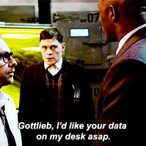
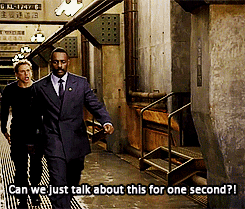
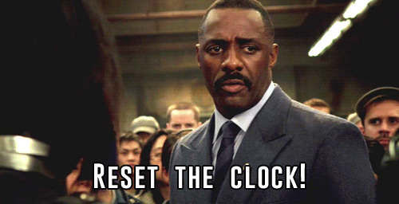

```
---
title:  "We gave 10% of their time for realizing their ideas to our developers, and this is what we've learned so far."
author: borsi
image: "/img/posts/"
tags: [company culture, freefriday, community, developers, communication, postmortem]
---
```

Six months have passed since we started our *very own* 'Sense/Net 10%' program, where any employee could assemble a team and work on a precious side-project in 10 percent of their time. We had our project closing TGIF presentation last Friday where every team talked about their experiences - and you wouldn't believe what happened next!

---

Setting aside the subtle clickbait at the end of the intro, we learned *a ton* in these past six months. Just to recap, these were our goals when [we started out](http://community.sensenet.com/blog/2017/06/28/free-friday): 

- Create more vibrant **company culture** by incentivizing cross-team communication.
- Fire up developer **motivation** by letting them work on projects they love and by taking a breath of fresh air from the daily grind.
- **Empower** people. Let them *own* their projects and with them, our company culture, mission, and values.

## Well, did we succeed?

Yes... well, sort of. We started this little experiment with three very different projects and teams. The results:

- 1 project that is about half complete

- 1 project, that has already been completed for 3 months

- and finally, 1 project, that is almost complete 

  

## What went well?

### Tangible results

When we started Free Friday, we didn't have a Community Site and our Knowledgebase was falling apart. Now we have both! We also have a logo animation, which works in chrome.  

[TODO: insert sensenet logo gif here]

### Engaging presentations

Apart from the fact that almost always the same three guys talked about their projects, these events were pretty good. Even though, the size of the projects and the speed of development differed vastly, everyone could show real progress every month. I was particularly happy, because I could see people, who rarely ever give presentations talk in front of the whole company.

### Learning, learning, learning

After talking with the participants, one thing stood out: people from different teams use vastly different best practices. When we mixed these people, these best practices - more or less - were shared with each other.  Not much of a surprise here, but nevertheless... great!

## What did we learn?

### Governance is tricky

Without any recommendation for project management techniques or any formal supervision, teams tended to simply omit the 'management' part of the project. Which makes sense: if you have **small,** **mature** teams with **clear goals**, you don't *necessarily* need managers ([at least it works for Basecamp](https://m.signalvnoise.com/threes-company-df77db78d1af)). But Free Friday teams are - by definition - not mature teams and the goals are not always clear for *everyone*. So chaos can rear its ugly head pretty quickly.

### Sometimes half-measures are necessary after all

Sense/Net Inc. has two, very different company profiles. The **Business Solutions** division has vastly different metrics than **Product Development**. This is why the hardest part of getting this project through the management team was to have PO's quit obsessing about their teams' velocities. 

We needed everyone to be on board so Friday afternoons won't be interfered with, because an extremely important **last minute feature request** lands unexpectedly in the backlog. So we decided to have no half-measures. Either we're all all-in, or not.

And even though management was truly fully on board, developers sometimes decided to do their daily work instead, because they felt it was necessary (Hey, we have these responsible guys here. Good on us!). With wonky governance and sometimes-absent team members, there were Friday afternoons when people naturally defaulted back to business as usual.


### Communication is hard

If you've ever tried to form your fancy project idea into a digestible format for a very diverse set of people, when even *you* don't know, what you really want, then you know what I'm talking about. Developers could really experience what it's like to be in a stakeholder or leadership position. 



But it'll never work flawlessly for the first try. 

## What's next?

When I asked "Should we have another iteration of Free Friday?", the unanimous and immediate answer was 'absolutely'. In spite of the mentioned shortcomings, people enjoyed participating in the experiment. Communication got a little better and the company got almost two finished products at the end of this six months.

In the past two weeks people were already asking me, when can they start new projects. I've received pretty good project ideas too! So developers are enthusiastic, which is great.



The next round is starting in **two weeks** and in the meantime, people can think up new project ideas. 

Just so we don't commit the same mistakes, we decided to change some of the original rules. These are:

- The next round is **3 months** long, instead of 6. Shorter iteration cycles should gradually produce better end-results.
- **Team sizes** can range from **1 to 3** people. The reason for at least 2-person teams was to incentivize collaboration between different teams. We realized though, that this way small, creative projects fall out of the basket. They'll get their chance now.
- People can move from one team to another within a, given the proper reasons. Right now we don't see why this should cause any troubles
- Presentations are every **2 week**. That's right, you have to talk *even more*.
- Free Friday is still on Friday afternoon. But if you have a Sprint Review and you talk with your FF and Business Solutions team, you can move your weekly 10% to a more appropriate time slot.

But otherwise everything stays the same. The type of the projects, the need for transparency and the frequent communication stays. My personal dream is that in time, most of the rules will wither away and this group dynamic we now call as 'Free Friday' will just melt into the company culture, enriching it with awesomeness.

See you in 3 months!