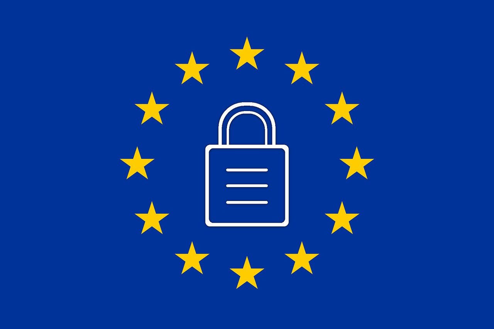

---

title: "How GDPR affects your document management platform?"

author: balazskeszei

image: "../img/posts/GDPR_cover.png"

tags: [enterprise content management, gdpr, information management]

---

# How GDPR affects your document management platform?

GDPR is the new EU General Data Protection Regulation, taking effect on 25 May 2018, aiming to give a better protection to personal and sensitive data and ensuring more rights to individuals than the current Data Protection Directive. It applies not only to organizations within the EU, but practically to ANY businesses or bodies that handle any personal data of EU citizens. The new regulation requires express consent or opt-in of individuals, and the right to opt-out practically any time, from any type of data processing option.

---

Besides the obvious legal implications these changes bring up many IT considerations as well – and if you leave preparing for compliance to the last minute, you might run late. GDPR compliance elevates the so far mainly administrative issues of document and records management into a strategic business priority, requiring C-level decisions and actions, accompanied perhaps by transition to [digital record management](https://www.sensenet.com/for-customers/use-cases) and automation.

**But what are these GDPR issues that might affect the way you manage your documents?**

1. **Document retention.** You need not only to record how often, exactly when and by whom your data are accessed, but you must also make sure that you manage your data properly across their entire life-span. Meaning you need to destroy documents / records properly at the end of their retention period. If you keep the same document both in digital and paper format, you must make sure that all instances are destroyed.

2. **Personal data processing.** You need to record the type of personal data, their source, all your processing activities and the other parties you share the data with. If you are using cloud services for any purpose, this means you need to make sure your cloud providers (and all their partners and subcontractors) comply with GDPR as well.
3. **Citizens’ rights.** The GDPR basically ensures the same rights as the current legislation, but with some enhancements, like portability of data. Any individual whose data you store shall have the right to access, correct or restrict use of their personal data, and, if requested, you should delete their personal data. You should be able to provide information on the data you store, and this shall be free of charge. Obviously, with manual processing, this might be quite an onerous task.
4. **Accuracy and adequacy.** All data you maintain shall be accurate and kept up-to-date. If you share data with third-parties, you must ensure they have up-to-date information as well. Also, adequacy is key: you shall only collect data that is necessary for your specific legitimate purpose, and must ensure that you keep data collection to the minimum.
5. **Security.** It is at the very core of the new regulation. Within a large organization, there are many entry and exit points where data – including protected personal and sensitive data – flow in and out of the system, and among the various roles within the company. You must make sure that all data is guarded and kept secure throughout its retention period – and you must also ensure that any parties you share these data with also keep them safe. This might require setting up a strict information security policy and a full revision of data handling processes.
6. **Children.** If your operations include collecting personal data from children under 16, you must ensure you ask for parental consent; children above 16 might give the consent on their own behalf. This means you might have to establish procedures to verify age and, if required, seek consent from the appropriate person exercising the parental rights.

Is your data management fully prepared for these challenges? Do your processes and practices in place allow you lean back and relax, and feel certain that you would comply with all these requirements? Do you have the appropriate security measures and degree of control? If not, think about the magic words: digitalization, integration, automation. If you have not yet introduced a digital document and records management system, GDPR provides a good opportunity to do so. Without a well-designed system that is built with privacy in mind it will be almost impossible to comply with its new requirements. Take your time and document management journey seriously. 
