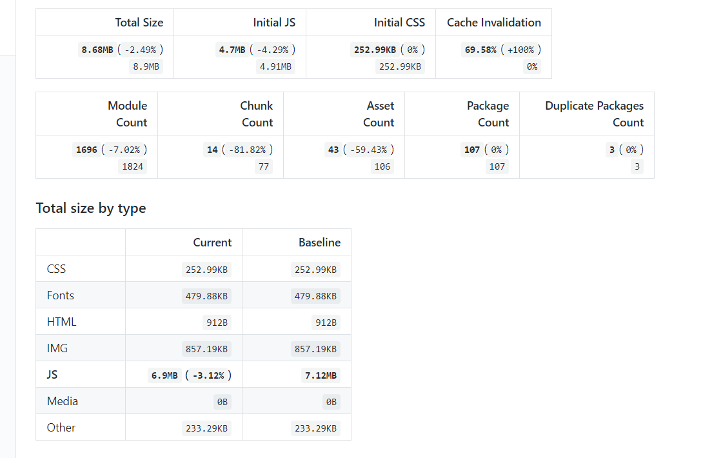
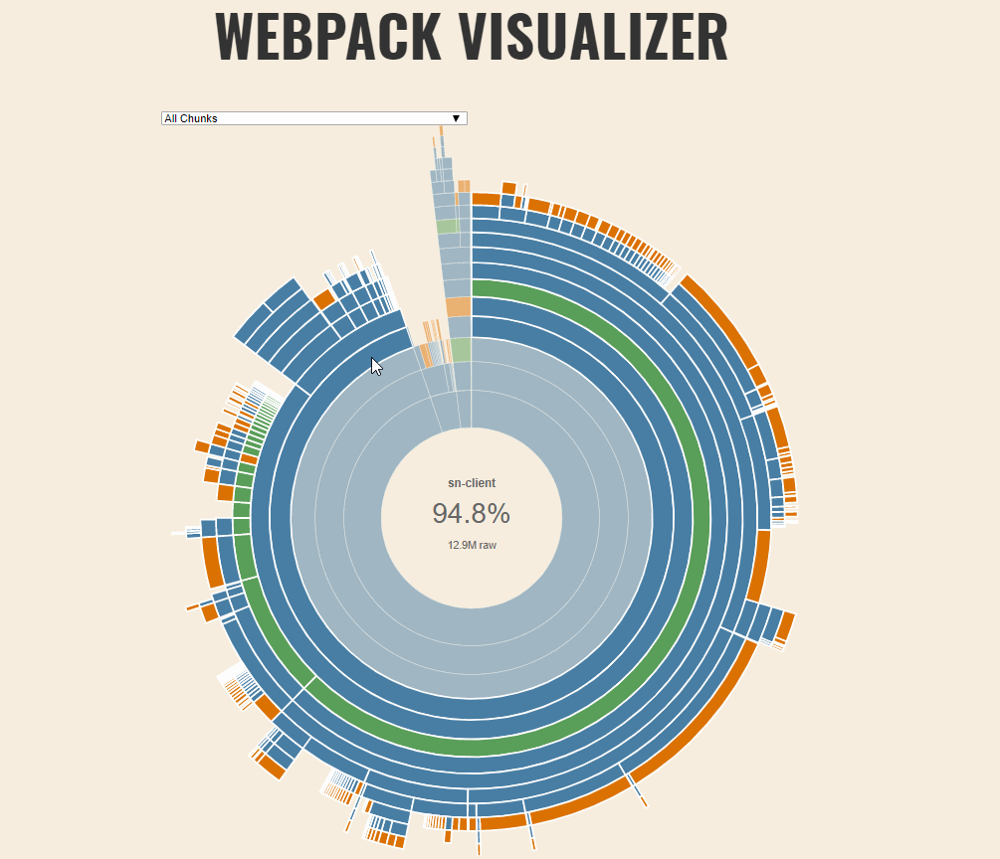
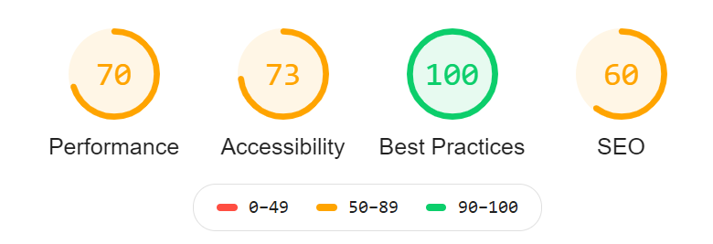
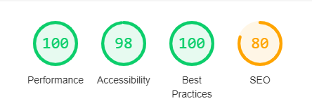

---

title: "Time is money: Performance improvements in sensenet"
author: [pusztaienike]
image: "../img/posts/time_is_money.png"
tags: [hacktoberfest, community, github]

---

How long will you wait for a website to load before you give up and go somewhere else?    Five seconds?    Ten seconds?  
 
Apparently, nearly half of us won't wait even three seconds.
In our busy world, every minute is a waste of time that we spend with waiting.
Of course, we know that, so we are about improving performance to avoid wasting your time.

---

## Divide it like Moses 🌊 [532](https://github.com/SenseNet/sn-client/pull/532)

As you already know we use webpack for module bundling in sensenet. Till that time, we did not care too much about the bundle size,
but our app is growing and growing so we had to change our mind and take some steps forward. 
The size of resources was ~57.3 MB and we had two opportunity for reduce:

1. We would use the [create-react-app](https://github.com/facebook/create-react-app) and its standard webpack configuration 
2. We would create our own webpack config(s). 

Because we use monaco editor and so many decorations in our code it is hard the match with create-react-app rules, so we have chosen the second option and divided our webpack configuration into 3 parts:

- one is for development purposes (webpack.dev.js)
- one is for production code (webpack.prod.js)
- and the remain is for both, commonly used settings (webpack.common.js)

We tried to follow the suggestions of create-react-app in this way as well.
And finally, we could reduce the resources size from ~57.3MB to ~8.1 MB with deploying 'real' production code with all its advantages like tree-shaking and source map removal. The transferred data became ~4.3 MB from ~12.7 MB so I declare with all confidence that it is worth the effort.

In the future, we would like to follow the changes what we can easily do with [RelativeCiAgent](https://relative-ci.com/). When we merge something to our develop branch RelativeCiAgent gets us a really transparent report of our bundle size.

I really like when I have to do nothing, RelativeCiAgent do the 'dirty job' instead of me. 😁
Thank you for the authors and all the contributors!

We can also check the size during development as well. We just added a new line for the package.json: 
`"build:stats": "webpack --config webpack.prod.js --profile --json > stats.json"` 

After generating the stats.js can make this file more transparent with [webpack-visualizer](https://chrisbateman.github.io/webpack-visualizer/)

## Quality is not an act, it is a habit. [550](https://github.com/SenseNet/sn-client/pull/550)

For improving the quality of our pages, we run [Lighthouse](https://developers.google.com/web/tools/lighthouse) on our landing page. It was interesting to see what did we miss during development. Okay these problems were small ones, but you know: "Many a little makes a mickle!" 

Our main problem was that we used a gif file as a loading item, and it was full screen sized, so huge. We decided to change it to a built-in loader from material-ui. We also fixed some small bugs, like:
- Buttons do not have an accessible name
- Image elements do not have alt attributes
- <html> element does not have a [lang] attribute
- Document does not have a meta description etc.

Our final result was the following after the fixes:

We were so prod of it. 😉 

## What's Next?

Our goal is to create a useful, and usable interface for every user, even though you have a slow internet connection. It is a continuous operation, we cannot say that 'We are done'. We would like to be better, and come up with new ideas. We only optimize our app to desktop, in our short-term plan we would like to do it for mobile as well.

So you know: "Time is money..", and we really appreciate your time.

